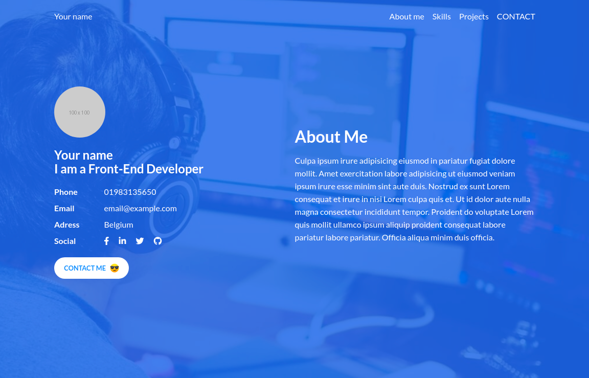

# frontend-portfolio

## Description

Personal website for Front-End Developer made with plain HTML and CSS.  
Responsive design, no JavaScript, frameworks and tools were used.  
Website use normalize.css for better browser support, and font awesome for icons.  
Contact form is not working, as this is static site, but it's ready to be used in future.

## Goal

I'm recreating a website based on a photo of the template.  
This exercise is part of the coding assignment which I have to complete to participate in the bootcamp.

## Different branches

I decided to make two branches in this repository.  
The master branch contains raw version of the project with placeholder images and text.  
The filled branch contains version filled with my personal data.

## Glitch.com

As a part of this exercise, I had to create this project at [Glitch.com](https://www.glitch.com "Glitch Homepage"), but I find out that I can just import GitHub repository there so I did that, and now I can write code in my code editor and track progress on my GitHub.
I will also provide link when project will be ready.
